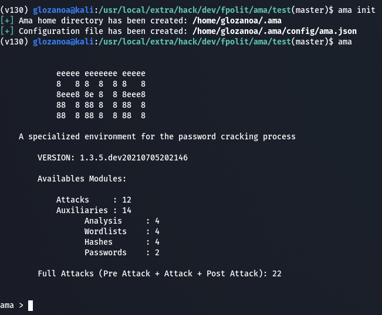

# ama - Attacks Manager

Ama is a specialized environment for the password cracking process. It contains several modules (attacks and auxiliaries), so you can find an appropiate module for each step of the password cracking process, also you can combine them to automatize the password cracking process.

## Dependencies
* *Python3.8* or *newer versions*
* [Hashcat](https://hashcat.net/hashcat/) (Only for *hashcat* attack modules)
* [John](https://github.com/openwall/john) (Only for *john* attack modules)


## Getting Starting
```bash
$ pip install ama-framework
```



**NOTE:**  
* *Ama-framework* was tested in the following GNU/Linux distributions:
     * Kali
     * Centos
     * Archlinux
     * Ubuntu

* If you want to submit attacks in a cluster of computers, you must have configured a cluster using [Slurm](https://slurm.schedmd.com/overview.html), also you must have installed *john* with *MPI* support.
* You only need to run `ama init` just one time, then you simply have to activate the virtual environment and run `ama`.

## Usage
Visit our [wiki](https://github.com/fpolit/ama-framework/wiki), there you can find useful documentation about `ama`.  


     Please do not use ama in military or secret service organizations,
                      or for illegal purposes.


Good luck!
glozanoa
